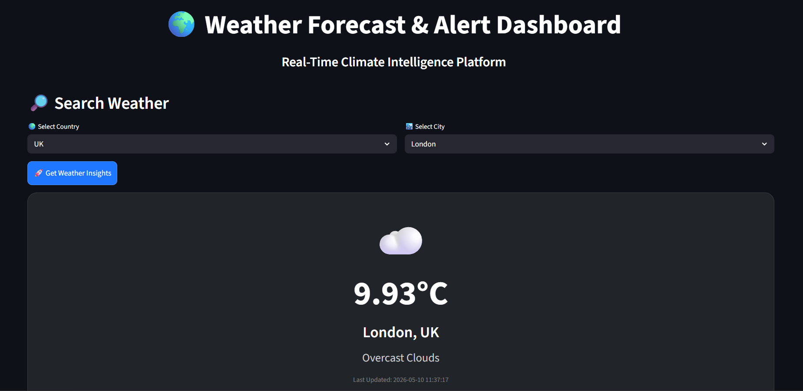
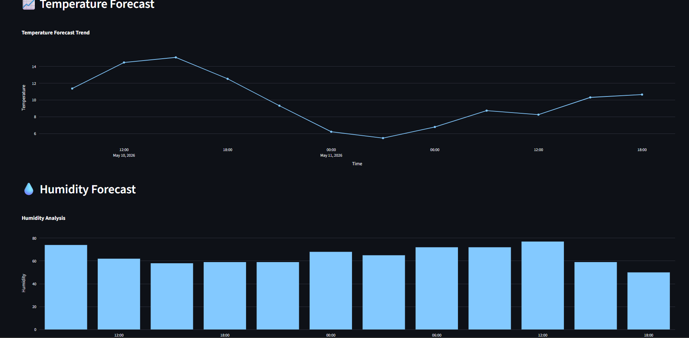
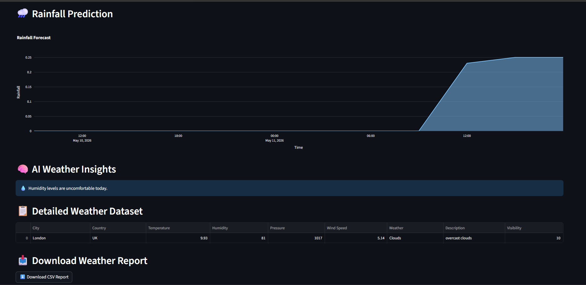
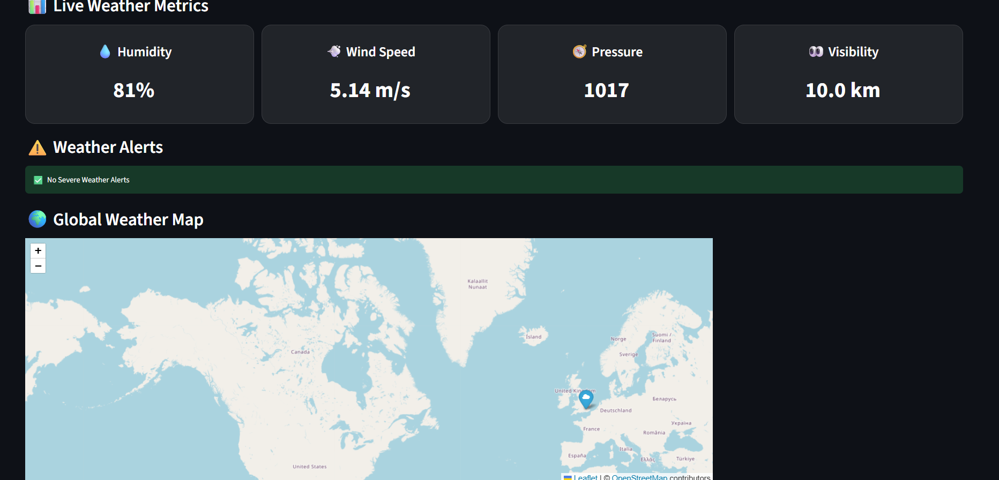

#  Weather Forecast & Alert Application

A modern real-time Weather Forecast & Alert Dashboard built using Python, Streamlit, OpenWeatherMap API, Plotly, and Folium.

This project provides:
- Real-time weather monitoring
- Forecast analytics
- Interactive global weather maps
- Weather alerts
- Rainfall prediction
- Temperature and humidity analysis
- AI-style weather insights
- Downloadable weather reports

---

#  Features

##  Real-Time Weather Data
- Current temperature
- Humidity
- Wind speed
- Pressure
- Visibility
- Weather condition

##  Forecast Analytics
- Temperature forecast graphs
- Humidity analysis
- Rainfall prediction charts

##  Interactive Global Map
- Live weather location mapping
- City pinpoint using Folium maps

##  Smart Weather Alerts
- Heatwave alerts
- High humidity alerts
- Rain alerts
- Strong wind alerts

##  AI Weather Insights
- Outdoor activity suggestions
- Travel condition insights
- Climate warnings

##  Downloadable Reports
- CSV weather reports

---

#  Technologies Used

- Python
- Streamlit
- OpenWeatherMap API
- Pandas
- Plotly
- Folium
- Streamlit-Folium
- Python Dotenv

---

#  Project Structure

---
Weather-Forecast-Alert-Application/
│
├── data/
├── docs/
├── images/
├── outputs/
├── reports/
├── src/
├── .env
├── .gitignore
├── README.md
├── requirements.txt
├── app.py
└── main.py
---

#   Installation

1️⃣ Clone Repository
git clone https://github.com/afrah-fks/Weather-Forecast-Alert-Application.git

2️⃣ Open Project
cd Weather-Forecast-Alert-Application

3️⃣ Create Virtual Environment
Windows
python -m venv venv
venv\Scripts\activate

Mac/Linux
python3 -m venv venv
source venv/bin/activate

4️⃣ Install Requirements
pip install -r requirements.txt

🔑 API Key Setup

Create a .env file in project root:

API_KEY=your_openweathermap_api_key

Get free API key from:

https://openweathermap.org/api

▶️ Run Application
streamlit run app.py

#  Application Screenshots

##  Main Dashboard

---

##  Temperature Forecast Chart

---

##  Rainfall Prediction Chart

---

##  Generated Weather Reports

#  Dashboard Preview

Features included:

- Weather cards
- Forecast charts
- Rainfall analytics
- Interactive maps
- AI insights
- Downloadable reports

#  Future Improvements

- Air Quality Index (AQI)
- Live weather radar
- SMS/Email alerts
- Multi-city comparison
- Machine learning forecasting
- Dark/Light theme toggle

# Use Cases

Useful for:

- Travelers
- Farmers
- Logistics companies
- Event planners
- Climate analysts
- Students learning API integration

# Learning Outcomes

This project demonstrates:

- API integration
- Real-time data processing
- Data visualization
- Dashboard development
- Weather analytics
- Alert system implementation
- GitHub project structuring